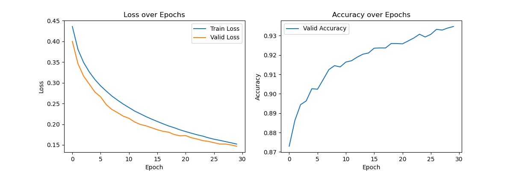

# 自然语言处理课程大作业--MTQE课程报告

**目录**

- [自然语言处理课程大作业--MTQE课程报告](#自然语言处理课程大作业--mtqe课程报告)
  - [总体介绍](#总体介绍)
  - [关于Bert预训练模型](#关于bert预训练模型)
    - [为什么既使用bert-base-chinese又使用bert-base-uncased](#为什么既使用bert-base-chinese又使用bert-base-uncased)
  - [数据集的处理](#数据集的处理)
  - [项目目录结构](#项目目录结构)
  - [训练模型](#训练模型)
  - [测试模型](#测试模型)
  - [参考文献](#参考文献)


## 总体介绍


本次大作业主要使用Bert预训练模型 $^{[1]}$ 搭建基于transformer架构 $^{[2]}$ 的MTQE模型以评估机器翻译的质量，更具体的说，模型能在词级别上实现对每个词质量（dtag）的标注。

如上图所示，MTQE的模型结构是典型的Encoder-Decoder架构，其中编码器使用`bert-base-chinese`中的预训练encoder实现，用于编码中文源输入语句；解码器使用`bert-base-uncased`中的预训练decoder实现，用于编码英文目标输入语句，同时利用交叉注意力结合encoder的输出。最终decoder经过一层全连接层，输出每个token的质量标签（OK、Minor、Major、Critical）的预测概率。

## 关于Bert预训练模型

因为实验过程中组里服务器未配置代理无法连接外网（[https://huggingface.co/](https://huggingface.co/)），所以这里将`bert-base-chinese`和`bert-base-uncased`提前下载在目录`./pretrained`（因为大小限制，最终提交的源码文件不含这一部分），若需要下载可按照以下目录结构去官网下载。

```arduino
bert-base-chinese/
├── config.json
├── pytorch_model.bin
├── vocab.txt

bert-base-uncased/
├── config.json
├── pytorch_model.bin
├── vocab.txt
```

> bert-base-chinese预训练模型官网：[https://huggingface.co/google-bert/bert-base-chinese](https://huggingface.co/google-bert/bert-base-chinese)
> 
> bert-base-uncased预训练模型官网：[https://huggingface.co/google-bert/bert-base-uncased](https://huggingface.co/google-bert/bert-base-uncased)

---

### 为什么既使用bert-base-chinese又使用bert-base-uncased

中文和英文的语言结构、语法、词汇表达方式差异较大。直接用同一个模型处理两种语言可能会出现一些问题。在本实验中，中文和英文的token需要映射到完全不同的词汇表。如果使用相同的模型，可能会导致对某些token的表示不足。

`bert-base-chinese` 是在中文数据上预训练的，它的 vocab.txt 是基于汉字和部分子词构建的；而`bert-base-uncased` 则是在英文数据上预训练的，它的 vocab.txt 是基于英文子词（WordPiece）构建的，不区分大小写。

比如考虑一个例子：

> 中国 生产 和 消费 世界 三分之二 的 猪肉 。
> 
> China produces and consumes two-thirds of the world 's pork . \<EOS>

如果只采用`bert-base-chinese`对其进行分词，会得到如下结果。可以看出对于中文至少还是支持的（虽然是简单的单字分词），但是对于英文的分词会显得有些莫名其妙。

```
['中', '国', '生', '产', '和', '消', '费', '世', '界', '三', '分', '之', '二', '的', '猪', '肉', '。']

['china', 'pro', '##du', '##ces', 'and', 'con', '##su', '##mes', 'two', '-', 't', '##hi', '##rd', '##s', 'of', 'the', 'world', "'", 's', 'po', '##rk', '.', '<', 'eos', '>']
```

而如果只采用`bert-base-uncased`对其进行分词，则会得到以下结果。此时对英文的分词是合理的，但是对于中文的则会出现许多无法识别的分词。

```
['中', '国', '生', '[UNK]', '和', '[UNK]', '[UNK]', '世', '[UNK]', '三', '分', '之', '二', '的', '[UNK]', '[UNK]', '。']

['china', 'produces', 'and', 'consume', '##s', 'two', '-', 'thirds', 'of', 'the', 'world', "'", 's', 'pork', '.', '<', 'e', '##os', '>']
```


## 数据集的处理

+ 实际训练中只用了`.zh`、`.en`以及`.dtag`三种文件。
+ 对于dtag建立了`{'OK': 0, 'minor': 1, 'major': 2, 'critical': 3}`的映射关系。
+ 对于所有的token序列均扩充到了`max_len`的长度（实验中分别取128和256进行了实验），使用注意力掩码记录真实序列长度。


## 项目目录结构

整个项目的目录结构如下：

```arduino
MQTE/
├── images/                         # 存放.md文件使用的图片
├── logs/                           # 存放训练过程中的日志文件
├── pretrained/                     # 存放预训练模型（因为太大，提交的源代码中未包含）
│   ├── bert-base-chinese/
│   │   ├── config.json
│   │   ├── pytorch_model.bin
│   │   └── vocab.txt
│   ├── bert-base-uncased/
│       ├── config.json
│       ├── pytorch_model.bin
│       └── vocab.txt
├── resource/                       # 存放数据集（提交的源代码中未包含）
│   ├── data/
│   ├── eval_script.py
│   └── README.md
├── results/                        # 存放训练得到的.pth模型文件和测试阶段的输出文件
├── dataset.py                      # 处理数据集
├── main.py                         # 训练主函数
├── model.py                        # 本实验构造的模型类
├── readme.md                       # 报告
├── summary.py                      # 改写自库函数torchsummary源码，因为源码只支持单个输入，所以改写了部分代码以支持本模型结构的输出
├── test_bert.py                    # debug文件（源码不含）
└── test.py                         # 测试主函数

```


## 训练模型

由于该任务本质是序列标注（四分类）任务，这里使用的损失函数为经典的交叉熵损失函数，使用Adam优化器，学习率设置为1e-5。训练的环境为`Python=3.9.20 torch=2.2.0+cuda12.1+cudnn8.9.2_0`。

使用训练集和验证集进行训练，可直接使用：

```bash
python main.py --data_dir "./resource/data" --model_path "./results" --logs_path "./logs" --gpu 0 --epochs 20 --batch_size 32 --max_len 128
```

训练过程中在验证集上验证得到的最好模型会被保存在 `data_dir` 路径下，训练过程中的日志文件会被保存在 `logs_path` 路径下。

第一次训练中， `epochs` 参数设为20、 `batch_size` 参数设为32、 `max_len` 参数设为128，模型参数量在0.2B左右，在使用NVIDIA RTX A6000单卡进行实验的情况下总耗时大致在4小时左右。最终的训练结果在验证集上（词dtag等级）达到了**92.7%** 的准确率。下图为 `epoch=20, max_len=128` 训练过程中的loss曲线和acc曲线。


可以发现，可能是使用bert预训练模型的原因，在初始epoch=0时的验证结果准确率就能达到 **87.2%** ，后续的训练中loss下降的幅度逐渐放缓，虽然最后训练结果似乎没有完全收敛，但是增幅也基本可忽略不计，特别是在最后5个epoch中acc的增长率不到0.5%。

由于后续在测试过程中发现测试集中有样本的序列长度超过了128（如下图），而由于之前 `max_len` 的限制，模型最多只能预测序列长度为128的样本，因此后面只能增大 `max_len` 重新训练。


第二次训练中，`epochs` 参数设为30、 `batch_size` 参数设为32、 `max_len` 参数设为256，还是在使用NVIDIA RTX A6000单卡进行实验的情况下总耗时大致在11个小时左右。最终训练结果在验证集上达到了 **93.5%** 的准确率。下图为 `epoch=30, max_len=256` 训练过程中的loss曲线和acc曲线。



## 测试模型

要对训练好的模型进行测试，可直接运行以下命令：

```bash
python test.py --data_dir "./resource/data" --model_path "./results/best_model.pth" --output_file "./results" --gpu 0 --batch_size 32 --max_len 256
```

如下图，运行结束后会在 `output_file` 路径下生成 `test.zh-en.dtag` 、 `test.zh-en.tag` 以及 `test.mqm_score` 三个文件，其中mqm_score是根据以下公式计算得到的：

$$
\mathrm{MQM}=1-\frac{n_\mathrm{minor}+5n_\mathrm{major}+10n_\mathrm{critical}}n
$$


如下图，最终结果使用 `eval_script.py` 可通过测试样例。


## 参考文献

[1]: Devlin, J., Chang, M. W., Lee, K., & Toutanova, K. (2018). BERT: Pre-training of Deep Bidirectional Transformers for Language Understanding. arXiv preprint arXiv:1810.04805.

[2]: Vaswani, A. (2017). Attention is all you need. Advances in Neural Information Processing Systems.
